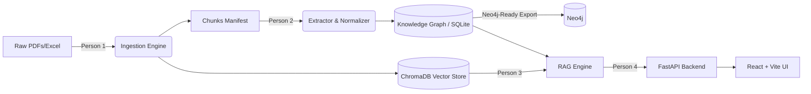

# OpsBrain2: Industrial Knowledge Brain

An AI-powered knowledge system that doesn't just answer questions—it actively detects contradictions and stale procedures across maintenance documents.

## Quick Start (New Developer)

### Prerequisites
- Python 3.11+
- Node.js 18+
- Git

### 1. Clone & Setup

```bash
git clone https://github.com/amrithasnidhi/OpsBrain2.git
cd OpsBrain2
```

### 2. Install Python Dependencies

```bash
pip install -r requirements.txt
```

### 3. Setup Environment Variables

Create a `.env` file in the root directory (or copy from `.env.example`):

```bash
# LLM Provider - Groq (Free Tier)
GROQ_API_KEY=your_groq_api_key_here

# Embeddings - Voyage AI
VOYAGE_API_KEY=your_voyage_api_key_here

# Optional
ANTHROPIC_API_KEY=your_anthropic_key_here
```

Get free API keys:
- Groq: https://console.groq.com/keys
- Voyage AI: https://dash.voyageai.com/

### 4. Run Ingestion Pipeline (First time only)

```bash
python -m ingestion.pipeline --input_dir data/raw --collection industrial_docs
```

This embeds documents into ChromaDB (~54 chunks).

### 5. Start the Backend

```bash
cd app/backend
python -m uvicorn main:app --host 127.0.0.1 --port 8000
```

### 6. Start the Frontend (New terminal)

```bash
cd app/frontend
npm install
npm run dev
```

### 7. Open the App

- Frontend: http://127.0.0.1:5173
- API Docs: http://127.0.0.1:8000/docs

---

## Architecture



*Note: The system is designed to be Neo4j-ready for massive scale, utilizing SQLite for the hackathon MVP.*

---

## Project Structure

```
OpsBrain2/
├── app/
│   ├── backend/
│   │   ├── main.py              # FastAPI entry point (thin shell)
│   │   └── routers/             # Each person adds their router here
│   │       └── core.py          # Core API routes
│   └── frontend/
│       ├── src/
│       │   ├── App.tsx          # Router shell (add routes here)
│       │   ├── routes/          # Each person adds their view here
│       │   │   └── ChatView.tsx
│       │   ├── components/      # Reusable UI components
│       │   └── types/           # TypeScript schemas
│       └── package.json
├── ingestion/                   # Person 1: Document processing
├── knowledge_graph/             # Person 2: Entity extraction
├── rag_engine/                  # Person 3: RAG + Conflict detection
├── shared/
│   └── schemas.py               # CONTRACT FILE - shared Pydantic models
├── data/
│   └── raw/                     # Source documents (PDFs, Excel, etc.)
├── .env                         # API keys (not committed)
└── requirements.txt
```

---

## API Endpoints

| Method | Endpoint | Description |
|--------|----------|-------------|
| POST | `/api/query` | RAG query with conflict detection |
| GET | `/api/conflicts` | All known conflicts for dashboard |
| GET | `/api/health` | Health check |
| GET | `/api/graph` | Knowledge graph nodes/edges |

---

## Team Development Rules

### Adding a Backend Route
1. Create `app/backend/routers/yourfile.py` with an `APIRouter`
2. Add 2 lines to `main.py`:
   ```python
   from app.backend.routers.yourfile import router as yourfile_router
   app.include_router(yourfile_router)
   ```

### Adding a Frontend Route
1. Create `app/frontend/src/routes/YourView.tsx`
2. Add to `App.tsx`:
   - One entry in `NAV_ITEMS` array
   - One `<Route>` element

### Schemas
- All shared types live in `shared/schemas.py`
- Frontend types mirror them in `app/frontend/src/types/schemas.ts`
- Don't edit schemas mid-branch - add fields via reviewed PR

---

## Live Demo Script

Our main differentiator is the **Conflict & Decay Detection**. Follow this exact script to demo the power of the platform:

### 1. Baseline RAG
**Ask:** *"What protective gear is needed when inspecting equipment?"*
- **Expected:** The system returns standard safety protocols with citations and a confidence badge. This proves our baseline document retrieval works.

### 2. The Differentiator: Planted Contradictions
**Ask:** *"What is the maximum operating pressure for Pump-P101?"*
- **Expected:** The system will answer the question based on the manual, BUT the **Flagged Conflicts** side panel will instantly light up in red.
- **Why?** It detected a direct contradiction between the SOP (`doc_manual_p101`) stating 150 PSI and a recent maintenance log (`doc_walkdown_p101`) recording 180 PSI.
- **Follow up:** Show that the system also flagged a past incident ("Overpressurization event due to mismatched gauges") related to this exact equipment tag.

### 3. Procedural Decay
**Ask:** *"When should Filter-F300 be replaced?"*
- **Expected:** The system provides the policy rule (every 6 months), but the Conflicts Panel highlights an orange Decay warning.
- **Why?** The policy dictates a 6-month interval, but the Knowledge Graph cross-referenced the last logged maintenance date and flagged that the interval is out of date.

---

## Troubleshooting

### VOYAGE_API_KEY not found
Make sure `.env` file exists in root directory and contains your key.

### Frontend shows blank page
```bash
cd app/frontend
rm -rf node_modules/.vite
npm run dev
```

### Backend import errors
```bash
pip install -r requirements.txt
```

---

Built for the Hackathon by a 4-person parallel development team.
