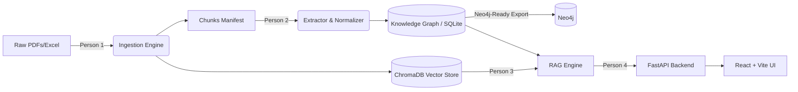

# OpsBrain2: Industrial Knowledge Brain

An AI-powered knowledge system that doesn't just answer questions—it actively detects contradictions and stale procedures across maintenance documents.

## Architecture



*Note: The system is designed to be Neo4j-ready for massive scale, utilizing SQLite for the hackathon MVP.*

## Setup & Run

We've bundled everything into a single command. 
From a clean checkout:

```bash
chmod +x run_all.sh
./run_all.sh
```
*(Requires Python 3.11 and Node.js)*

## Live Demo Script

Our main differentiator is the **Conflict & Decay Detection**. Follow this exact script to demo the power of the platform:

### 1. Baseline RAG
**Ask:** *"What protective gear is needed when inspecting equipment?"*
- **Expected:** The system returns standard safety protocols with citations and a confidence badge. This proves our baseline document retrieval works.

### 2. The Differentiator: Planted Contradictions
**Ask:** *"What is the maximum operating pressure for Pump-P101?"*
- **Expected:** The system will answer the question based on the manual, BUT the **Flagged Conflicts** side panel will instantly light up in red.
- **Why?** It detected a direct contradiction between the SOP (`doc_manual_p101`) stating 150 PSI and a recent maintenance log (`doc_walkdown_p101`) recording 180 PSI.
- **Follow up:** Show that the system also flagged a past incident ("Overpressurization event due to mismatched gauges") related to this exact equipment tag.

### 3. Procedural Decay
**Ask:** *"When should Filter-F300 be replaced?"*
- **Expected:** The system provides the policy rule (every 6 months), but the Conflicts Panel highlights an orange Decay warning.
- **Why?** The policy dictates a 6-month interval, but the Knowledge Graph cross-referenced the last logged maintenance date and flagged that the interval is out of date.

---
Built for the Hackathon by a 4-person parallel development team.
