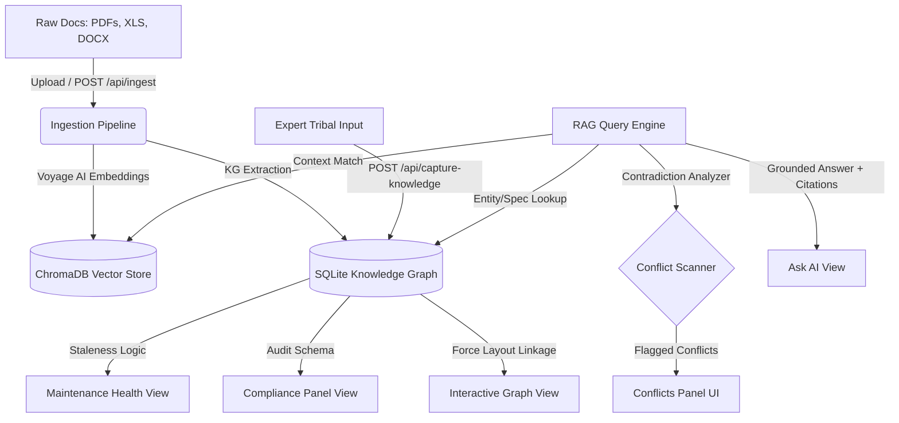

# OpsBrain²: Industrial Knowledge Brain

An AI-powered knowledge system that doesn't just answer questions—it actively detects contradictions, regulatory gaps, and stale procedures across maintenance documents and tribal knowledge.

---

## Table of Contents
1. [Core Features](#core-features)
2. [Concrete Use Cases & Scenarios](#concrete-use-cases--scenarios)
3. [Inner Workings & Architecture](#inner-workings--architecture)
4. [Detailed Setup & Installation](#detailed-setup--installation)
   - [Backend Setup](#1-backend-setup)
   - [Frontend Setup](#2-frontend-setup)
5. [API Documentation](#api-documentation)
6. [Project Structure](#project-structure)
7. [System Verification & Demo Scripts](#system-verification--demo-scripts)

---

## Core Features

OpsBrain² integrates seven core functional modules designed to centralize and protect industrial operational intelligence:

1. **Ask AI (Grounded RAG Engine):** Query maintenance manuals, SOPs, and incident reports. Answers are returned with full citations, direct document excerpts, real-time confidence scores, and inline conflict alerts if contrasting source documents exist.
2. **Document Ingestion (Add Document):** An automated pipeline (`POST /api/ingest`) that accepts PDFs, Excel spreadsheets, Word docs, text files, and images. It processes documents into vector embeddings stored in ChromaDB, runs entity/relationship extraction, updates the knowledge graph, and re-scans the environment for conflicts.
3. **Capture Knowledge (Tribal Knowledge):** Form-based entry designed to record undocumented procedures, observation logs, and failure patterns directly from senior technicians. This expert data is instantly indexed, made searchable, and cited in AI responses.
4. **Compliance Status (Regulatory Gap Detection):** Continuously cross-references equipment parameters against safety standards (e.g., **OSHA 29 CFR 1910.119**, **ISO 10816**). Dynamically computes status categories: *Compliant*, *Gap Found*, or *Unknown* (missing documentation).
5. **Maintenance Health (Staleness Tracking):** Tracks inspection intervals extracted from manuals and compares them against actual maintenance records. Evaluates schedules dynamically to show *Healthy*, *Warning*, or *Overdue* statuses.
6. **Field View (Operator Portal):** A simplified, mobile-friendly interface designed for on-the-floor operators featuring voice-to-text querying and immediate alerts for safety/maintenance conflicts on specific equipment tags.
7. **Interactive Knowledge Graph:** A full-width interactive force-directed canvas that visualizes equipment tags, document nodes, and relationship edges. Direct contradictions are animated in red, offering click-to-view conflict cards with detailed source side-by-sides.

---

## Concrete Use Cases & Scenarios

### Use Case 1: Resolving Facility Discrepancies During Turnarounds
* **Scenario:** An engineering team is planning a maintenance turnaround for a relief system. The design document dictates that the pressure safety valve `PSV-101` should open at 150 PSI. However, a recent walkdown log notes it was adjusted to 180 PSI.
* **How to use:** 
  1. Go to **Add Document** and upload the recent walkdown log.
  2. Ask the chatbot under **Ask AI**: *"What is the relief pressure threshold for PSV-101?"*
  3. The system highlights the design threshold, but the **Flagged Conflicts** pane highlights a high-risk contradiction, showing the side-by-side values (150 PSI vs 180 PSI) and links to both source files. The engineering team can resolve the mismatch before performing maintenance.

### Use Case 2: Regulatory Audit and Gap Analysis
* **Scenario:** An auditor asks for compliance statuses against safety regulation **OSHA 29 CFR 1910.119** (Process Safety Management of Highly Hazardous Chemicals).
* **How to use:**
  1. Open the **Compliance** tab.
  2. The dashboard groups requirements by standard and lists each tracked piece of equipment.
  3. Items marked **GAP** indicate active non-compliance (e.g., policy dictates a fire drill every 6 months but none is logged).
  4. Items marked **UNKNOWN** highlight missing documentation. This prompts safety officers to upload missing training registers to turn the status to **COMPLIANT**.

### Use Case 3: Capturing Expert Tribal Knowledge
* **Scenario:** A senior operator who has worked at the facility for 30 years is retiring. They know that `PUMP-203` starts vibrating abnormally during high humidity, a pattern not recorded in any vendor manual.
* **How to use:**
  1. Navigate to **Capture Knowledge**.
  2. Enter the details: Expert Name (e.g., "Dave Miller"), Equipment Tag (`PUMP-203`), select **Tribal Knowledge**, and write the observation.
  3. Click **Save to Knowledge Base**.
  4. If a junior operator later asks: *"Why is PUMP-203 vibrating?"*, the AI returns the advice, citing Dave Miller as the source.

---

## Inner Workings & Architecture



### 1. The Ingestion Engine
When a document is ingested:
- Text is extracted, parsed, and split into semantic chunks.
- Chunks are embedded using **Voyage AI** and saved into a local **ChromaDB** vector store.
- Structured data (entities like equipment tags, parameters, threshold values) are parsed via LLM entity extraction and written to an **SQLite database** (acting as our relational knowledge graph).

### 2. The Conflict & Decay Engine
- **Conflict Scanning:** When new information is added, a background routine checks for keys matching existing equipment parameters. If a value mismatch exists between two sources, a record is added to the `conflicts` table.
- **Decay/Staleness Tracking:** A calculation evaluates the days elapsed since the `last_inspection_date` against the `required_interval` for all registered equipment to output warning flags.

---

## Detailed Setup & Installation

Follow these steps to set up the complete stack locally.

### 1. Backend Setup

#### Prerequisites
- **Python 3.11+** installed and added to your system path.

#### Setup Steps

1. **Navigate to the project root:**
   ```bash
   cd OpsBrain2
   ```

2. **Create a virtual environment (Recommended):**
   * **Windows:**
     ```powershell
     python -m venv venv
     .\venv\Scripts\Activate.ps1
     ```
   * **macOS / Linux:**
     ```bash
     python3 -m venv venv
     source venv/bin/activate
     ```

3. **Install the required packages:**
   ```bash
   pip install -r requirements.txt
   ```

4. **Configure your Environment (`.env`):**
   Create a `.env` file in the root folder of the project:
   ```env
   GROQ_API_KEY=your-groq-api-key
   VOYAGE_API_KEY=your-voyage-api-key
   ```
   *Note: If you don't have Voyage API keys, the system has fallback mechanisms using direct token/text matching for local development.*

5. **Start the FastAPI backend:**
   ```bash
   cd app/backend
   python -m uvicorn main:app --host 127.0.0.1 --port 8000 --reload
   ```
   On startup, the lifecycle event handler in `app/backend/main.py` automatically initializes `knowledge.db` SQLite database if it does not already exist.

---

### 2. Frontend Setup

#### Prerequisites
- **Node.js (v18 or higher)**
- **npm (comes packaged with Node.js)**

#### Setup Steps

1. **Open a new terminal window and navigate to the frontend directory:**
   ```bash
   cd OpsBrain2/app/frontend
   ```

2. **Install node dependencies:**
   ```bash
   npm install
   ```

3. **Run the Vite development server:**
   ```bash
   npm run dev
   ```
   The application will boot up at [http://localhost:5173](http://localhost:5173).

---

## API Documentation

| Method | Endpoint | Payload / Params | Description |
| :--- | :--- | :--- | :--- |
| **POST** | `/api/query` | `{ "question": "string" }` | RAG query returning answers, citations, confidence scores, and active conflicts. |
| **POST** | `/api/ingest` | `file: UploadFile` (Multipart) | Ingests a new document, runs semantic vector indexing, updates SQLite KG, and scans for conflicts. |
| **POST** | `/api/capture-knowledge` | `{ "expert_name", "equipment_tag", "knowledge_type", "free_text" }` | Inserts unstructured tribal knowledge directly into the knowledge graph. |
| **GET** | `/api/conflicts` | None | Lists all currently flagged contradictions in parameters. |
| **GET** | `/api/graph` | None | Returns nodes and edges representing the complete system schema for the graph visualizer. |
| **GET** | `/api/staleness` | None | Returns maintenance schedule data, tracking decay metrics against policies. |
| **GET** | `/api/compliance` | None | Checks captured equipment parameters against regulatory standards (OSHA, ISO). |

---

## Project Structure

```
OpsBrain2/
├── app/
│   ├── backend/
│   │   ├── main.py              # FastAPI entry point & DB startup hook
│   │   └── routers/             # API Router registrations
│   │       ├── core.py          # Query, Ingestion, Tribal Knowledge endpoints
│   │       ├── dashboards.py    # Staleness, Graph rendering endpoints
│   │       └── risk_compliance.py # Compliance alignment endpoints
│   └── frontend/
│       ├── src/
│       │   ├── App.tsx          # Main navigation shell & layout setup
│       │   ├── index.css        # Premium dark glassmorphism design variables
│       │   ├── routes/          # Navigation views (StalenessDashboard, GraphView, etc.)
│       │   ├── components/      # UI components (UploadForm, ChatPanel, ConflictCard)
│       │   └── types/           # Shared TypeScript schemas
│       └── package.json
├── ingestion/                   # Document parsing & Vector Database pipelines
├── knowledge_graph/             # Graph database extractors & DB initialization
├── rag_engine/                  # Grounding, Conflict & Decay reasoning models
├── shared/
│   └── schemas.py               # Shared Pydantic models (contract files)
├── data/
│   └── raw/                     # Mock documents for system verification
├── .env                         # Environment configurations
└── requirements.txt             # Python packages
```

---

## System Verification & Demo Scripts

### 1. Test Ingestion
1. Open the UI to the **Add Document** tab.
2. Select a PDF file (e.g. from `data/raw/`) and click **Ingest Document**.
3. Confirm that it returns a success message detailing chunks ingested.

### 2. Verify Conflict Scan
1. Go to the **Ask AI** tab.
2. Query: *"What is the relief pressure for PSV-101?"*
3. Verify that the answer prints with a confidence badge and a warning displays in the right side panel detailing conflicting values.

### 3. Build & Production Check
Verify that the frontend builds without TypeScript compiler errors:
```bash
cd app/frontend
npm run build
```
